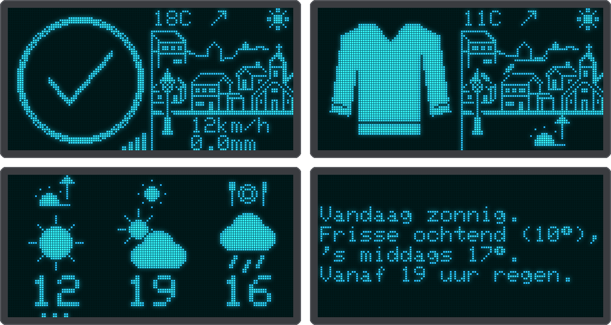

# Dayspeck

<p align="center"></p>

An open-source weather display for a bedside table, a hallway or a kitchen wall, on an ESP8266 (ESP-01)
with a 0.96" 128×64 SSD1306 I²C OLED and the free Open-Meteo forecast. You put it together like building blocks: pick from ten screens, put them in the order
you like and choose what a tap or a long press shows, all in the device's web page. One firmware, no
rebuilding.

**📖 Manual: <https://martijn4313.github.io/Dayspeck/>**

## What it can show

- **Ride rating:** *can I ride today?* A check mark, exclamation mark or cross next to an animated village,
  for today or tomorrow, plus a 7-day grid and the next hours with the best time to leave.
- **Picture screens:** *what do I wear today?* Outfits, weather pictures and one temperature for the
  morning, afternoon and dinner time, and a countdown in sleeps to birthdays and holidays. No words, so young
  children can use them.
- **Weather report:** the day in a few short sentences, in English or Dutch, written on the device by fixed
  rules.
- **Clock.**

The village comes alive with the weather: rain, snow, gusts, autumn leaves. A demo in the web page shows
every screen and animation in a minute and a half.

## Hardware

An ESP-01 (ESP8266, 1 MB flash), an SSD1306 128×64 I²C OLED, a 3.3 V supply and, optionally, a TTP223 touch
module or a push button. Without a button the screens can cycle by themselves. Wiring and other boards:
[hardware](https://martijn4313.github.io/Dayspeck/hardware/).

## Quick start

Requires [PlatformIO](https://platformio.org).

```sh
pio test -e native            # host unit tests for the pure logic
pio run -t upload             # flash the firmware over serial
pio run -t uploadfs           # flash firmware/data (config.json) to the filesystem
```

An ESP-01 is flashed with a USB-serial adapter and GPIO0 held low at power-up. The touch sensor shares the
RX pin, so disconnect it while flashing. Then join the `Dayspeck` WiFi network the device opens and follow
the [first boot](https://martijn4313.github.io/Dayspeck/first-boot/) steps. Later updates go
[over the air](https://martijn4313.github.io/Dayspeck/ota/) once the signing key and the relay are set up.

The forecast comes from [Open-Meteo](https://open-meteo.com): free, no account or API key, and only the
configured location is sent.

## Project layout

```
docs/                   the manual (MkDocs) and its pictures
firmware/src, include   device code (display, touch, weather, web server, main loop)
firmware/lib/motologic  pure logic, unit tested on the host
firmware/data           files for the LittleFS filesystem (config.json)
test/                   host-side unit tests
tools/                  bitmap converter and OLED simulator, screenshot scripts, OTA signing tool and relay
plans/                  design notes and the history of the project (partly out of date)
```

## Building the manual

```sh
pip install -r requirements-docs.txt
mkdocs serve        # live preview at http://127.0.0.1:8000
mkdocs build --strict
```

The manual is published to GitHub Pages by `.github/workflows/docs.yml` on every push to `main`. The
pictures in it are renders of the firmware's drawing code: `tools/docs_screenshots.py`,
`tools/screen_pictures.py` and `tools/webui_screenshots.py` regenerate them.

## Contributing

CI (`.github/workflows/ci.yml`) runs the unit tests, builds the firmware and the filesystem image, checks
that the firmware leaves room for an over-the-air update, and lints and tests the Python tools. See the
manual's [contributing](https://martijn4313.github.io/Dayspeck/contributing/) page. A tag `vX.Y.Z`
publishes a signed release, once the `OTA_SIGNING_KEY` secret is set
([how](https://martijn4313.github.io/Dayspeck/ota/#one-time-setup)).

## License

GNU General Public License v3.0, see [LICENSE](LICENSE).
