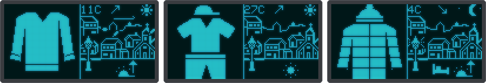
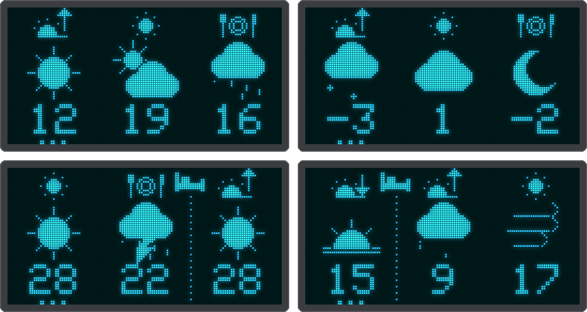
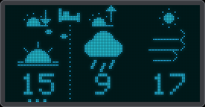
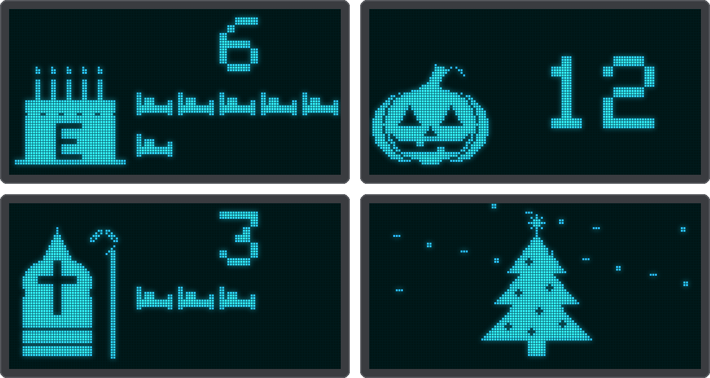

# Picture screens: what do I wear today?

Four screens without words: what to wear and what the weather is like, with pictures and numbers, and the
sleeps to birthdays and holidays. They are made for children of about 4-5 who are learning to read, and they
are just as handy on a hallway wall for anyone who wants the day at a glance.

With the *Kids* preset (see [Your own display](screens.md)) the village is the home screen; a tap shows the
weather, the next tap the clothes, and another tap (or 30 s) goes back home. When a birthday or holiday is
near, the countdown comes after the clothes.

## Village

On the left the outfit for now, big; on the right the animated village of the [ride screen](rider.md) with the
temperature, the sun or the moon, rain, snow, gusts and autumn leaves. On the street a small picture says
which part of the day the outfit is for. From 22:00 (bedtime) until the morning it is tomorrow morning's
outfit, with a bed in front of it: what to put out before going to sleep. It is the same outfit as the first
one on the clothes screen.

{ .center }

## The day in three parts

The weather and clothes screens show **the next three parts of the day**, read from left to right: morning
(7-12), afternoon (12-18) and evening (18-22). They start with the current part, so they never show what is
past:

| Time | Columns |
|------|---------|
| 10:00 | the rest of this morning, this afternoon, this evening |
| 14:00 | the rest of this afternoon, this evening, tomorrow morning |
| 19:00 | the rest of this evening, tomorrow morning, tomorrow afternoon |
| at night | tomorrow morning, afternoon and evening |

The current part has **three dots** underneath. Where a night lies between two columns there is a dotted line
with a **bed** at the top: that part comes after sleeping. The symbol at the top of a column says which part
it is:

| Symbol | Meaning |
|--------|---------|
| half sun on the horizon, arrow up | morning (the sun comes up) |
| small sun | afternoon (the sun is high) |
| half sun on the horizon, arrow down | evening (the sun goes down) |

**Clothes screen:** one outfit per part of the day. The outfits, from warm to cold (the limits are the
defaults, see [Settings](#settings)):

{ .center }

| When | Picture |
|------|---------|
| 25 °C and up, sunny, daytime | sun cap, t-shirt and shorts |
| 20 °C and up | t-shirt and shorts |
| 15 to under 20 °C | t-shirt |
| 5 to under 15 °C | sweater |
| rain or thunderstorm (5 °C and up) | hooded rain coat and boots |
| 0 to under 5 °C | winter coat and scarf |
| below 0 °C, or snow | winter coat, scarf, hat and mittens |

**Weather screen:** the same three parts, each with a weather picture (sun or moon, partly cloudy, cloud,
rain, thunderstorm, snow, wind) and its temperature: a number to read, without a unit.

{ .center }

**One number per part.** Each part of the day has one temperature that the weather screen shows and the
outfit goes by, so the number and the picture always match:

| Part | Its temperature | Why |
|------|-----------------|-----|
| morning | the **lowest** | that is the walk to school, usually right at the start |
| afternoon | the **highest** | how people talk about the day: "this afternoon it gets 17" |
| evening | the temperature at **18:00** | when the kids may still play outside; 22:00 is bedtime |

For the current part only the hours still to come count, and for the current hour the current conditions
(Open-Meteo's estimate of the weather right now, not a thermometer reading). A morning of 10° at 7:30 and 17°
from 11:00 shows **10 and a sweater**, not the 16 of late morning; at 19:00 the evening shows the temperature
of now.

The weather picture goes by the wettest weather of the part: one hour with 0.2 mm of rain or more (or a
thunderstorm) makes it rain, and the outfit a rain coat (unless it is cold enough for the winter coat).

**Autumn leaves** blow across the weather and clothes screens when the wind is up (gusts from 20 km/h on,
and not while it rains, storms or snows). They stay in the upper part of the screen, above the numbers, and
show as inverted dots so the pictures stay readable. Autumn is September to November, and March to May in the
southern hemisphere; it needs the network time, so the leaves appear once the clock is synced.

{ .center }

## Countdown

From 14 sleeps before a birthday or holiday (adjustable), the countdown screen shows the picture of the day on
the left and the number of sleeps (nights) still to go on the right. With ten sleeps or fewer there is also a
row of beds to count, one for every night, so one goes away each morning. On the day itself the picture stands
in the middle with confetti falling around it.

{ .center }

| Day | Picture |
|-----|---------|
| birthday (two can be set) | a cake with a candle for every year it turns (10 and older: the age as a number) and the child's letter on it |
| Halloween, 31 October | a pumpkin |
| Sinterklaas (pakjesavond), 5 December | the mitre and staff |
| Christmas, 25 December | a Christmas tree |

When two are in range, the nearest one is shown (a birthday wins a tie). The screen only exists while a
countdown is running; for the rest of the year a tap skips it. It needs the network time, like the autumn
leaves. A birthday on 29 February counts down to 28 February in other years.

## Settings

Under *Clothing* in the [web UI](web-ui.md) you can change the temperature limits of the outfits (and
the gust speed for the wind picture), for a child who feels the cold sooner or later than the defaults. The
limits must go from warm to cold; an equal pair skips that outfit, for example a sweater limit equal to the
shorts limit has no t-shirt step. They are saved in `config.json` (the `kids` keys, see the
[configuration reference](configuration.md)) and are always in °C.

Under *Countdowns* you enter the two birthdays (the date of birth, for the number of candles, and a
letter for the cake), switch Halloween, Sinterklaas and Christmas on or off, and set from how many sleeps
before the day the countdown starts.

The hours of the parts of the day are compile-time settings (`KIDS_*_HR` in
`firmware/lib/motologic/motologic.h`). The weather and clothes screens have no rain animation and no `OLD` or
`UPD` mark; the village has the animations of the ride screen, and no marks.
