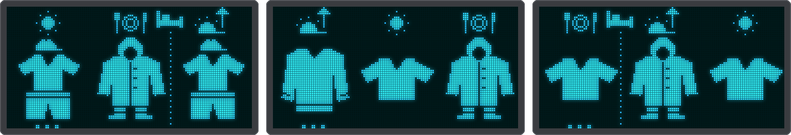

# Kids variant: what do I wear today?

A second firmware build for children of about 4-5 who are starting to read. Instead of the ride
rating it shows what to wear and what the weather is like, with big pictures and numbers and no
words. Both screens are split in two: **left is now, right is later**, with an arrow between them and
a small symbol that says when "later" is. A tap on the touch sensor switches between the clothes and
the weather screen (the weather screen closes by itself after 30 s).

{ .center }

**Clothes screen.** The outfits, from warm to cold (the limits are the defaults, see *Settings* below):

| When | Picture |
|------|---------|
| 25 °C and up, sunny, daytime | sun cap, t-shirt and shorts |
| 20 °C and up | t-shirt and shorts |
| 15 to under 20 °C | t-shirt |
| 5 to under 15 °C | sweater |
| rain or thunderstorm (5 °C and up) | hooded rain coat and boots |
| 0 to under 5 °C | winter coat and hat |
| below 0 °C, or snow | winter coat, hat, scarf and mittens |

**Now and later.** The left half is the weather right now. The right half is the next 6 hours: their average
temperature and the wettest weather in that time. When something big happens in
the 6 hours after that (1 mm of rain or more in an hour, a thunderstorm or snow while the next hours are
dry, or a temperature two outfits warmer or colder), the right half shows that instead, so a sunny
morning can still say "rain coat this afternoon". From 18:00 until 05:00 the right half shows tomorrow
morning (from 7:00) instead.

The symbol under the arrow says when "later" is:

| Symbol | Meaning |
|--------|---------|
| half sun with an arrow up | morning (6-12) |
| small sun | afternoon (12-18) |
| half sun with an arrow down | evening (18-22) |
| moon | night |
| bed | tomorrow morning, after sleeping |

{ .center }

**Weather screen:** the same split, with a big picture (sun or moon, partly cloudy, cloud, rain,
thunderstorm, snow, wind) and the temperature on each side: a number to read, no unit.

**Autumn leaves.** In autumn leaves blow across both screens when the wind is up (gusts from 20 km/h on,
and not while it rains, storms or snows). They stay in the upper part of the screen, above the temperature
numbers, and show as inverted dots so the pictures stay readable. Autumn is September to November, and
March to May in the southern hemisphere; it needs the network time, so the leaves appear once the clock is
synced.

{ .center }

**Settings.** In the web UI under *Display*: *Always sleep*: the screen stays off and a touch wakes it for
30 s (the first touch only wakes it). It also works in the normal build. *Language* has no visible effect
since the screens no longer show words.

Under *Clothing (kids)* you can change the temperature limits of the outfits table above (and the gust speed
for the wind picture), for a child who feels the cold sooner or later than the defaults. The limits must go
from warm to cold; an equal pair skips that outfit, for example a sweater limit equal to the shorts limit has
no t-shirt step. They are saved in `config.json` (the `kids` keys, see the
[configuration reference](configuration.md)) and are always in °C.

The 6 hour window, the look-ahead and the evening switch are compile-time settings (`KIDS_*` in
`firmware/include/config.h`). The rain animation and the `OLD` tag are left out in this build (the autumn
leaves are not); WiFi, location, the web UI and OTA work as before.

```sh
pio run -e esp01_1m_kids -t upload
```
