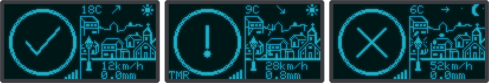
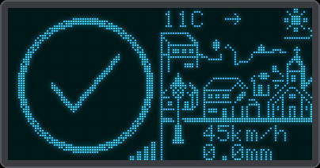
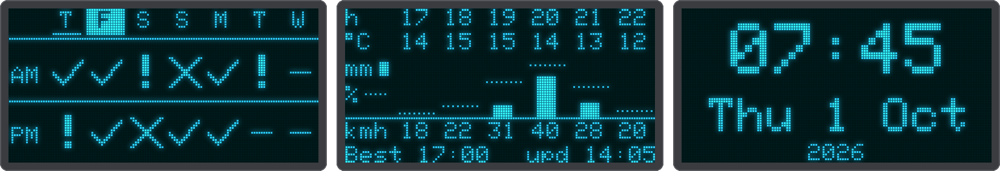
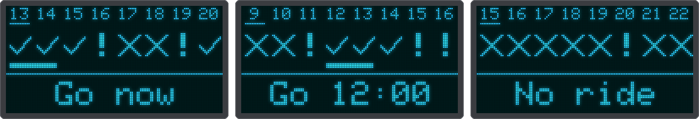

# Ride screens

For motorcyclists and cyclists: **can I ride today?** at a glance, the week ahead and the best time to leave.
How the rating is worked out is on its own page: [how the ride rating works](ride-rating.md).

## Ride rating (`ride`, `rideOther`)

{ .center }

- **Left half:** a big ride badge: ✓ good, ! caution, X don't ride.
- **Right half:** a little village with the temperature and a trend arrow, and the sun or the moon above it.
  The street lamp is lit at night. The weather shows in the scene itself: rain falls and splashes on the
  pavement, snow drifts, and the wind blows (see below). The wind speed and the rain are written on the
  street at the bottom.
- **Today or tomorrow:** `ride` shows today, and tomorrow from the *Tomorrow from (hour)* setting on (17 in the
  shipped `config.json`, 24 = never); `rideOther` shows the other day. With the Rider preset a tap switches between the two.
- **Status marks:** signal bars at the bottom of the left half (a cross when offline), `TMR` while tomorrow
  is shown, `OLD` when the data is stale (older than twice its refresh interval) and `UPD` when a
  [firmware update](ota.md) is ready.

## Wind and autumn leaves

When it is windy (a steady wind of 25 km/h or more, and dry) curled gusts sweep across the village from left
to right, faster and more of them the harder it blows.

{ .center }

In autumn leaves tumble along with the wind: from a wind speed of 20 km/h on, even on a day that is not
windy enough for gusts, as long as it is not raining or snowing. Autumn is September to November, and March
to May if the location is in the southern hemisphere. It needs the network time and the time zone, so the
leaves only appear once the clock is synced. The leaves keep flying when you switch between screens that
share the village.

## The week and the next hours

{ .center }

- **Week grid (`week`):** the morning and evening ride of seven days, starting today. The best day (see
  the [ride score](ride-rating.md#ride-score-and-best-day)) is shown in inverse video.
- **Next hours (`hours`):** six columns, with a label on the left naming each row: `h` the hour, `°C` the
  temperature, `mm` a bar for the rain amount (taller = more), `%` a dotted line for the chance of rain
  (higher = likelier) and `kmh` the strongest gust. The bottom line shows the best time to leave in the
  next 12 hours (a 2 hour daytime ride, between 06:00 and 22:00) and when the data was last updated:
  *Leave now*, *Best 14:00*, or *No good ride* when every 2 hour window ahead is rated "don't ride"
  (in Dutch *Vertrek nu*, *Beste 14:00*, *Niet rijden*).

The third screen in the picture is the [clock](screens.md#the-clock).

## Ride hours

{ .center }

The screen `rideHours` answers *when can I ride?* at a glance. Its columns are the next eight hours, the
current one underlined, each with its own [rating](ride-rating.md): ✓ good, ! caution, ✗ don't ride. A bar
marks the best 2 hour ride, the same one as on the next hours screen, and the bottom line says in large type
when to go: *Go now*, *Go 12:00*, or *No ride* when every 2 hour window ahead is rated "don't ride" (in Dutch
*Ga nu*, *Ga 12:00*, *Geen rit*).
