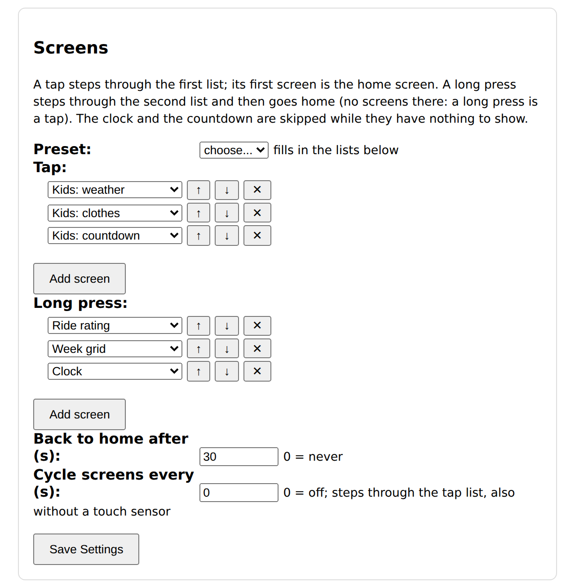
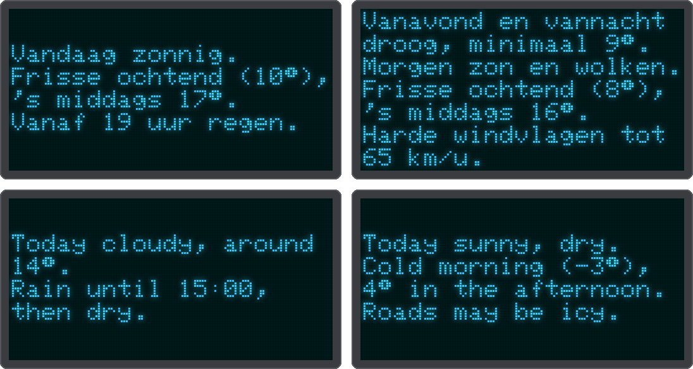
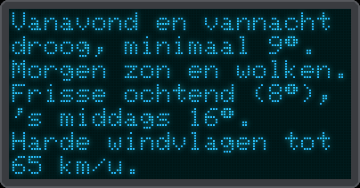

# Screens

There is one firmware with all screens. Which of them the device shows, and in which order, you choose in
the web UI under **Screens** (or in `config.json`, see below). So a household can have the kids' weather as
the home screen and the ride rating one long press away, or only the clock and the week grid.

{ .center }

## The screens

| Name | Screen |
|------|--------|
| `ride` | [Ride rating](rider.md) of today (tomorrow from the *Tomorrow from (hour)* setting on), with the animated village |
| `rideOther` | The ride rating of the other day |
| `week` | The 7-day AM/PM ride grid |
| `hours` | The next hours: temperature, rain, gusts, the best time to leave |
| `clock` | The clock (skipped until the time is known) |
| `weather` | [Kids](kids.md): the weather for the next three parts of the day |
| `clothes` | Kids: what to wear for the next three parts of the day |
| `countdown` | Kids: the sleeps to a birthday or holiday (skipped while none is near) |
| `village` | Kids: what to wear now, next to the animated village of the ride screen |
| `report` | [The weather report](#the-weather-report): the day in a few short sentences |

## Tap, long press, back home

- **Tap list.** A tap steps through it and wraps around at the end. Its **first screen is the home screen**,
  so it cannot be the clock or the countdown (they are not always there).
- **Long-press list.** A long press (1 s) steps through it; after its last screen the next long press goes
  home. A tap in this list also goes home. Leave it empty and a long press works like a tap.
- **Back to home after (s).** Any other screen returns to the home screen after this many seconds (default
  30); 0 keeps it until you tap.
- **Cycle screens every (s).** The device steps through the tap list by itself, this many seconds per screen;
  0 (default) is off. For a device without a touch sensor (switch it off under *Display*), or to show
  everything in turn. A touch still works: the screen you pick stays for a full cycle time.
- The clock and the countdown are skipped while they have nothing to show.
- Up to 6 screens per list; a screen may appear in both.
- Every screen redraws after each weather update (every 15-17 minutes by day, hourly at night) and on the
  quarter hours (:00, :15, :30, :45), so the numbers follow the forecast and the kids screens move on to the
  next part of the day on the hour.

**Presets** fill in both lists in one go:

| Preset | Tap | Long press |
|--------|-----|------------|
| Rider (the default) | ride rating, the other day | week grid, next hours, clock |
| Kids | kids village, weather, clothes, countdown | weather report |

After choosing a preset you can still change the lists, then press *Save Settings*.

The kids settings cards (*Clothing* and *Countdowns*) only show in the web UI while a kids screen is in one
of the lists.

## The weather report

The `report` screen sums up the day in a few short sentences, for the grown-ups: with the kids preset it is
one long press away, and any other list can have it too. It is in English or Dutch, by *Language* under
*Display* in the web UI.

{ .center }

During the day it is about the rest of today, until 22:00. From 18:00 on it starts with the evening and the
night, and then goes on with tomorrow, 07:00 to 22:00; from 22:00 it starts with the night. The device
writes it itself from the hourly forecast, by fixed rules:

1. **The evening and the night** (from 18:00): their rain, and the lowest temperature until 07:00, for
   example *Vanavond regen, vannacht droog, minimaal 3°.*
2. **The day:** the sky (sunny, sun and clouds, cloudy, foggy), the rain (dry, mostly dry, a shower at times,
   showers, rain, heavy rain, drizzle, snow, thunderstorms) and the temperature, from lowest to highest, or
   *around* one number when it hardly changes. A morning at least 5 degrees colder than the afternoon gets
   its own sentence, with the coldest morning hour and the warmest afternoon hour.
3. **A change:** a shower around an hour, rain from an hour on, or rain until an hour and then dry.
4. **One thing to watch out for**, the first that applies: frost tonight or during the day (roads may be
   icy), gusts of 60 km/h or more, 10 mm of rain or more, gusts of 45 km/h or more.

An hour counts as wet from 0.2 mm, as on the kids screens. The report redraws like every screen (see above). When the sentences do not fit on the screen (7 lines), the least important ones are left
out first: the change and the fresh morning, then the warning; the day and the night always stay.

**On a windy day** (gusts above the *wind picture* limit under *Clothing (kids)*, 50 km/h by default) the report
does not just make way for the next screen: its letters blow away first, from the right, faster in stronger
gusts. A touch during the animation goes straight on.

{ .center }

## In config.json

```json
"display": {
  "screens": {
    "tap": ["weather", "clothes", "countdown"],
    "hold": ["ride", "week", "clock"],
    "returnSeconds": 30
  },
  "cycleSeconds": 0
}
```

Without a `display.screens` block (or with an invalid one) the device uses the rider preset. A device that
ran the former separate kids firmware (its `config.json` has a `kids` block but no screens) starts with the
kids preset, so it keeps showing the kids screens after the update.
