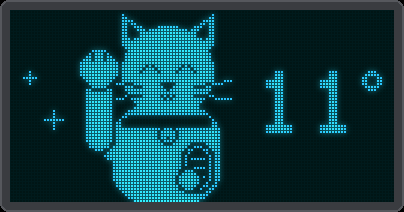

# Your own display

Dayspeck has ten screens. Which of them your device shows, in which order, and what a tap or a long press
does, you choose in the web UI under **Screens** (or in `config.json`, see below). Nothing needs to be
rebuilt or reflashed.

{ .center }

## The screens

| Name | Screen |
|------|--------|
| `ride` | [Ride rating](rider.md) of today (tomorrow from the *Tomorrow from (hour)* setting on), with the animated village |
| `rideOther` | The ride rating of the other day |
| `week` | The [7-day ride grid](rider.md#the-week-and-the-next-hours), morning and evening |
| `hours` | The [next hours](rider.md#the-week-and-the-next-hours): temperature, rain, gusts, the best time to leave |
| `rideHours` | The [ride rating of the next hours](rider.md#ride-hours) and when to go |
| `village` | [What to wear now](kids.md#village), big, next to the animated village |
| `weather` | [The weather in pictures](kids.md) for the next three parts of the day |
| `clothes` | [What to wear](kids.md) for the next three parts of the day |
| `countdown` | [The sleeps](kids.md#countdown) to a birthday or holiday (skipped while none is near) |
| `report` | [The weather report](report.md): the day in a few short sentences |
| `clock` | [The clock](#the-clock) (skipped until the time is known) |
| `cat` | [The lucky cat](#the-lucky-cat), beckoning, with the temperature |

The screens with the village (`ride`, `rideOther` and `village`) have the rain, snow, gusts and autumn
leaves; the leaves also blow across `weather` and `clothes`.

## Tap, long press, back home

- **Tap list.** A tap steps through it and wraps around at the end. Its **first screen is the home screen**,
  so it cannot be the clock or the countdown (they are not always there).
- **Long-press list.** A long press (1 s) steps through it; after its last screen the next long press goes
  home. A tap in this list also goes home. Leave it empty and a long press works like a tap.
- **Back to home after (s).** Any other screen returns to the home screen after this many seconds (default
  30); 0 keeps it until you tap.
- **Cycle screens every (s).** The device steps through the tap list by itself, this many seconds per screen;
  0 (default) is off. See [without a touch sensor](#without-a-touch-sensor).
- The clock and the countdown are skipped while they have nothing to show.
- Up to 6 screens per list; a screen may appear in both.

## Ready-made combinations

The *Preset* choice fills in both lists in one go. Use one as it is, or as a start and change the lists
before you press *Save Settings*:

| Preset | Tap | Long press |
|--------|-----|------------|
| Rider (the default) | ride rating, the other day | week grid, next hours, clock |
| Kids | village, weather, clothes, countdown | weather report |

Some other ideas:

| For | Tap | Long press |
|-----|-----|------------|
| a rider with children | village, weather, clothes | ride rating, week grid, weather report |
| the grown-ups only | weather report, next hours, clock | week grid |
| a wall without a button (cycle every 20 s) | weather report, ride rating, clock | (none) |

The cards for the outfits (*Clothing*) and the countdowns (*Countdowns*) only show in the web UI while a
screen that uses them is in one of the lists.

## Without a touch sensor

The touch sensor is optional. Switch it off in the web UI under *Display* (or with `display.touchEnabled` in
`config.json`) and set *Cycle screens every (s)* (`display.cycleSeconds`): the device then shows the screens
of its tap list in turn, each for that many seconds, so put everything you want to see in the tap list.

A touch sensor keeps working while the screens cycle: a tap picks a screen and it stays for a full cycle
time. While they cycle, nothing goes back to the home screen by itself, because every screen already stays
for the cycle time. *Always sleep* needs the touch sensor, because a touch is the only way to wake a
switched-off screen; the quiet hours and the night sleep timer work without one.

## Screen power

The panel can be dimmed at night (to *Night brightness*, 10 % by default; a touch gives full brightness for
30 s), switched off after some idle minutes at night, and switched off during fixed quiet hours (for example
23 to 6). A touch wakes it: the first touch only wakes it, and it then stays on for 30 s, even in quiet
hours. *Always sleep* keeps it off until a touch. All of this is under *Display* in the web UI and needs the
clock to be synced, which happens after the first weather update.

## When the screens change

Every screen redraws after each weather update: every 15-17 minutes by day, and about once an hour at night,
when the device fetches less often. The weather report and the village also redraw on the hour, so the
report turns to tomorrow at 18:00 and the outfit follows the part of the day. The animations run at 15 frames per second while there is something
to animate.

## The clock

The time in large digits with a blinking colon, then the weekday and the date, then the year. It needs the
network time and the first weather update (which tells the device its time zone); until then a tap skips
it.

{ .center }

## The lucky cat

A maneki-neko, the beckoning cat of good fortune, with a gold coin in one paw. The other paw beckons about
once a second: it tips towards you, turning its toe beans to you, and back up, while little sparkles
twinkle. The temperature stands beside it.

{ .center }

## Demo

*Play demo* in the web UI (under *Display*) shows about a minute and a half of every screen and animation with
made-up weather: the ride screen in sun, rain, a windless downpour, driving rain in a gale, snow and a stormy
autumn night; the village in drizzle, in slanting rain and with leaves; the weather and clothes screens; a birthday countdown and Christmas day with confetti; the weather report blowing away;
then the next hours, the ride hours, the lucky cat, the week grid and the clock. With *Repeat* it starts over until you press *Stop demo*
or touch the sensor (any touch stops it).

The demo does not change your settings or the real forecast, and afterwards the device goes back to its home
screen. While it plays the screen stays on at full brightness, even during quiet hours. The week grid and the
clock show the real data.

## In config.json

```json
"display": {
  "screens": {
    "tap": ["village", "weather", "clothes", "countdown"],
    "hold": ["report"],
    "returnSeconds": 30
  },
  "cycleSeconds": 0
}
```

Without a `display.screens` block (or with an invalid one) the device uses the Rider preset. A device that
ran the earlier separate kids firmware (its `config.json` has a `kids` block but no screens) starts with
the weather, clothes and countdown screens on a tap, as before, and the weather report on a long press.
