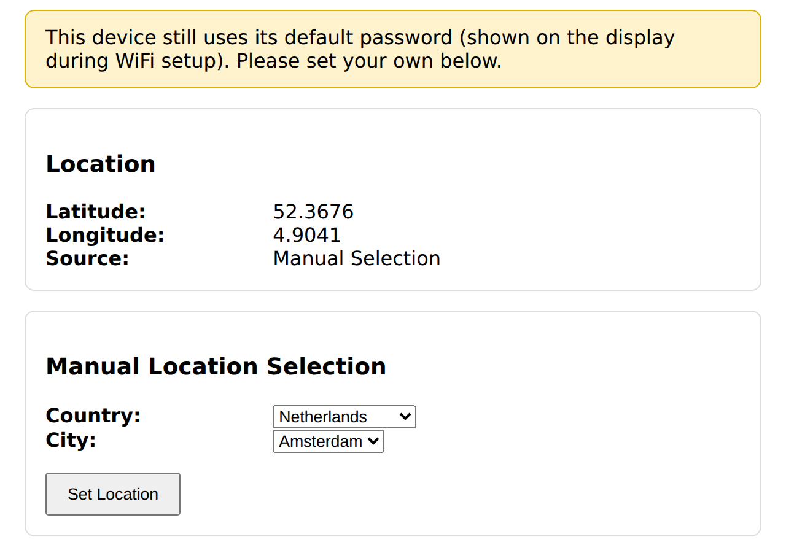
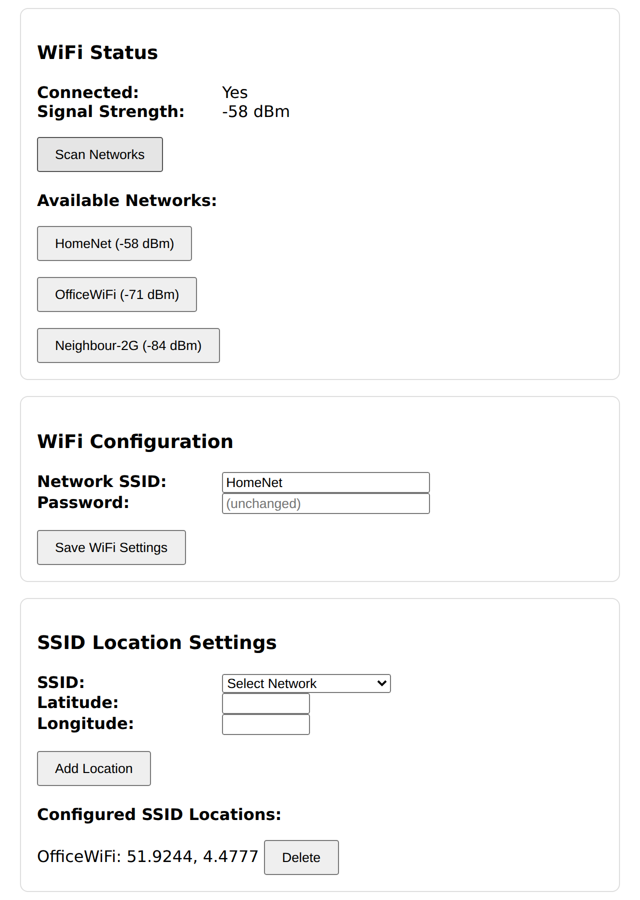
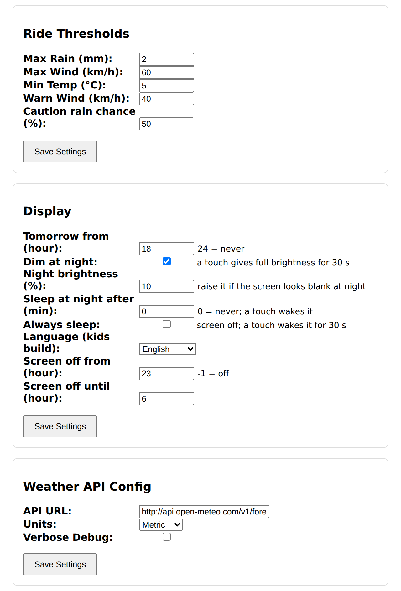
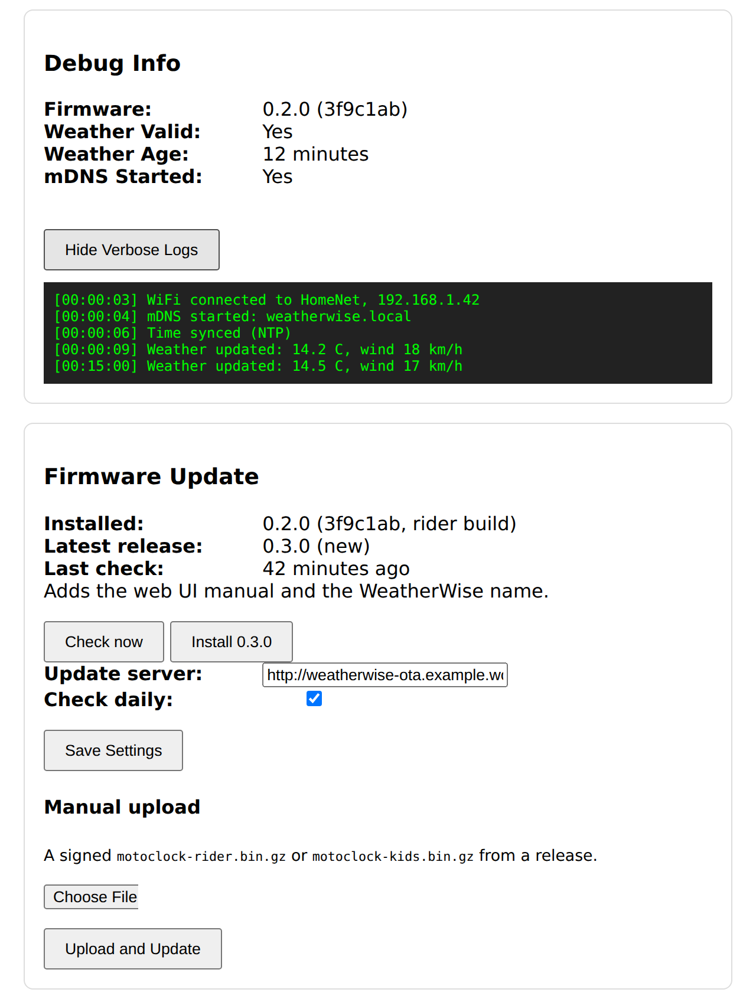

# Web UI

Everything about the device is set in its web page: location, WiFi, the ride thresholds, the display
options and firmware updates. Open `http://weatherwise.local` (or the device's IP address) in a browser
on the same network.

The page asks for a login: user **`admin`** and your admin password. Until you set your own, the
password is the default one shown on the display during WiFi setup (see [first boot](first-boot.md)).
After 10 failed attempts the page locks for a minute.

Each card has its own **Save** button, and a green or red bar at the top of the page tells you whether
it worked. The settings are stored in [`config.json`](configuration.md) on the device.

!!! note
    The screenshots below are renders of the real page with demo data, made with
    `tools/webui_screenshots.py`, not photos of a device.

## Location and the default-password banner

{ .center }

- **Location** shows the coordinates the forecast uses and where they came from: *Manual Selection*,
  *SSID-based*, *Configuration file* or *Default Fallback*.
- **Manual Location Selection**: pick a country and a city and press *Set Location*. The device then
  ignores any [per-network location](#per-network-locations).
- The yellow banner only shows while the device still has its default password. Set your own in the
  [Admin Password](#admin-password) card.

## WiFi

{ .center }

- **WiFi Status** shows whether the device is connected and the signal strength in dBm (closer to 0 is
  better; around -70 or lower is weak). *Scan Networks* lists the networks in range. Pressing one fills
  in the network name below.
- **WiFi Configuration**: the network name (1-32 characters) and its password (8-63 characters, or empty
  for an open network). The saved password is never sent back to the browser, so the field shows
  `(unchanged)`; leave it empty to keep the current one. *Save WiFi Settings* makes the device connect
  to the network right away.

If the connection is lost the device keeps retrying, and opens its own setup network again after 5
minutes without a connection (see [first boot](first-boot.md)).

### Per-network locations

*SSID Location Settings* ties a location to a WiFi network, so a device that moves between home and the
office shows the local forecast at each. Pick a scanned network (press *Scan Networks* first), enter its
latitude and longitude and press *Add Location*. Up to 10 can be stored; *Delete* removes one. A location
chosen with *Manual Location Selection* takes precedence.

## Ride thresholds, display and weather

{ .center }

**Ride Thresholds** are the limits behind the [ride rating](ride-rating.md). All values are metric.

| Field | Meaning |
|-------|---------|
| Max Rain (mm) | more rain than this over a ride window gives *don't ride* (0-100) |
| Max Wind (km/h) | gusts above this give *don't ride* (0-200) |
| Min Temp (°C) | below this the rating is *caution* (-50 to 50) |
| Warn Wind (km/h) | gusts above this give *caution*; it cannot exceed the maximum wind |
| Caution rain chance (%) | a chance of rain from this value on gives *caution*; 101 switches it off |

**Display** (see also [screen power](ride-rating.md#screen-power)):

| Field | Meaning |
|-------|---------|
| Tomorrow from (hour) | from this local hour the main screen shows tomorrow's ride; 24 = never |
| Dim at night | lower the brightness at night; a touch gives full brightness for 30 s |
| Night brightness (%) | the brightness when dimmed (1-100). Raise it if the screen looks blank at night |
| Sleep at night after (min) | switch the panel off after this many idle minutes at night; 0 = never |
| Always sleep | the screen stays off; a touch wakes it for 30 s |
| Language (kids build) | `en` or `nl`; the kids screens show no words, so this has no visible effect |
| Screen off from / until (hour) | quiet hours, for example 23 and 6. Set both, or both to -1 for none |

Dimming and sleeping need the clock to be synced, which happens after the first weather update.

**Weather API Config**: the forecast address (default Open-Meteo), the units (*Metric* or *Imperial*;
imperial only changes the temperature on the display) and *Verbose Debug*, which logs extra detail.
The address must start with `http://`, as the device cannot do TLS.

## Admin password

The *Admin Password* card protects the page, firmware updates and the WiFi setup network. Enter the
current password and the new one twice (8-63 characters). **The device restarts** after a change, and
you sign in again with the new password.

## Debug info and firmware updates

{ .center }

- **Debug Info** shows the firmware version, whether the weather data is valid, how old it is and
  whether mDNS (the `weatherwise.local` name) started. *Show Verbose Logs* prints the device log in
  the page. The device has no serial output because the touch sensor uses the RX pin, so this is
  where to look when something does not work.
- **Firmware Update**: *Check now* asks the update server for the latest release. When a newer one is
  out, *Install X.Y.Z* appears; nothing installs by itself. The install takes about a minute and
  settings are kept. The *Update server* address and *Check daily* are described under
  [over-the-air updates](ota.md), which also covers the *Manual upload* form.
