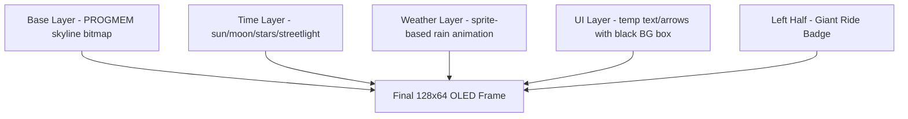
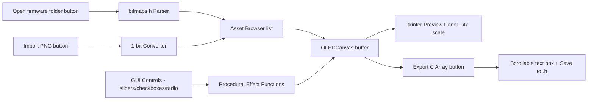
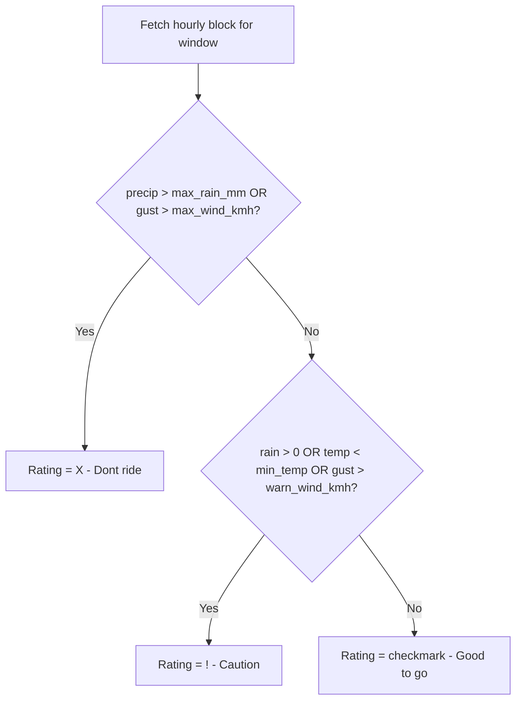

# MotoWeather Bedside Display — Project Plan

## Proposed File Structure

```
MotoClock/
├── design_memo.md                      # Architecture & engineering spec
├── plans/
│   ├── project_plan.md                 # This file
│   ├── todo.md                         # Full task checklist
│   └── png_to_bitmap_architecture.md   # Python tool design spec
│
├── firmware/                           # PlatformIO project root
│   ├── platformio.ini                  # Board, environment, library dependencies
│   ├── src/
│   │   └── main.cpp                    # Entry point: setup() + loop()
│   ├── include/
│   │   ├── config.h                    # Compile-time constants (WiFi, API, pins, thresholds)
│   │   ├── bitmaps.h                   # All PROGMEM static bitmap byte arrays
│   │   ├── display.h                   # Display rendering declarations
│   │   ├── weather.h                   # Weather fetch & ride decision declarations
│   │   └── touch.h                     # Touch input declarations
│   ├── src/
│   │   ├── display.cpp                 # Composite rendering engine implementation
│   │   ├── weather.cpp                 # Open-Meteo API, ArduinoJson stream filter, ride logic
│   │   └── touch.cpp                   # GPIO3/RX capacitive touch handler
│   └── data/
│       └── config.json                 # Runtime config stored in LittleFS
│
├── assets/
│   └── src/                            # Source 1-bit PNG pixel art files
│       ├── skyline_base.png            # 64x20 px town skyline silhouette
│       ├── sun.png                     # 8x8 or 10x10 px sun
│       ├── moon.png                    # 8x8 or 10x10 px moon
│       ├── cloud.png                   # 16x10 px cloud
│       ├── rain_cloud.png              # 16x12 px rain cloud
│       ├── arrow_ur.png                # 7x7 px trend arrow up-right
│       ├── arrow_dr.png                # 7x7 px trend arrow down-right
│       └── arrow_r.png                 # 7x7 px trend arrow flat-right
│
└── tools/
    ├── png_to_bitmap.py                # GUI app: PNG converter + OLED simulator + weather previewer
    └── requirements.txt                # Python dependencies (Pillow only; tkinter is stdlib)
```

> **Note on PlatformIO structure:** `src/` serves double duty — PlatformIO treats all `.cpp` files in `src/` as build sources. Headers live in `include/`. The `data/` directory is uploaded to LittleFS via the PlatformIO "Upload Filesystem Image" task.

---

## PlatformIO Configuration (`firmware/platformio.ini`)

```ini
[env:esp01_1m]
platform  = espressif8266
board     = esp01_1m
framework = arduino

lib_deps =
    adafruit/Adafruit SSD1306 @ ^2.5
    adafruit/Adafruit GFX Library @ ^1.11
    bblanchon/ArduinoJson @ ^7.0

board_build.filesystem = littlefs
upload_speed            = 115200
monitor_speed           = 115200
```

---

## System Architecture: Composite Rendering Layers



---

## Python GUI Tool Architecture (`tools/png_to_bitmap.py`)



---

## Key Firmware Modules

| Module | Responsibility |
|---|---|
| `platformio.ini` | Board target, library deps, LittleFS config |
| `src/main.cpp` | WiFi init, LittleFS mount, main state machine loop, animation frame timing |
| `include/config.h` | SSID, password, API endpoint, display pin assignments |
| `include/bitmaps.h` | All `PROGMEM` byte arrays for static assets (including rain drop and splash sprites) |
| `include/display.h` | Display rendering declarations, RainDrop and Splash struct definitions |
| `src/display.cpp` | All rendering: badge, skyline, overlays, bottom card, weekly matrix, rain animation engine |
| `src/weather.cpp` | HTTP GET, ArduinoJson streaming filter, ride decision algorithm |
| `src/touch.cpp` | GPIO3 debounce, short-tap vs long-press detection |
| `data/config.json` | Lat/lon, commute windows, ride thresholds (loaded at runtime from LittleFS) |

---

## Ride Decision Logic Flow


