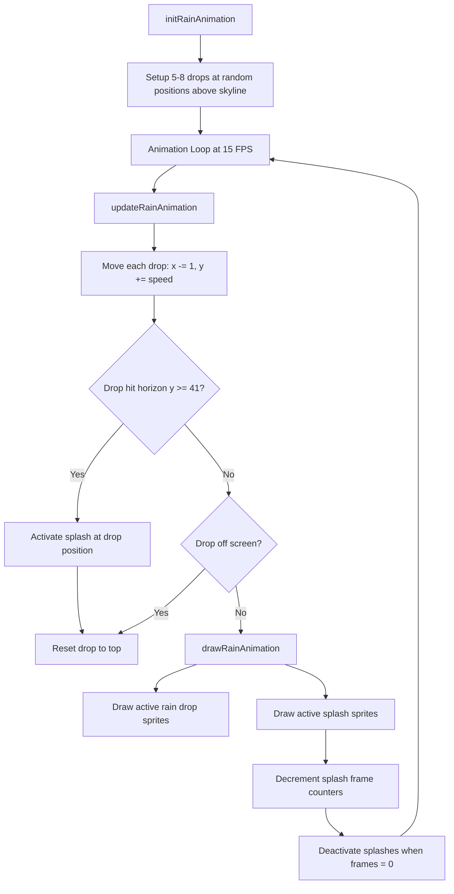
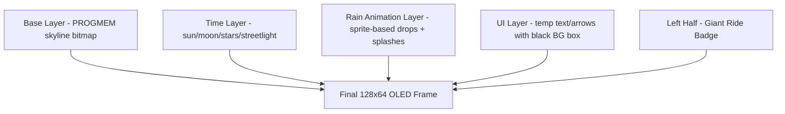

# Rain Animation System Architecture

## Overview

The rain animation system uses sprite-based graphics with physics simulation to create realistic rain drops falling across the skyline display. Rain drops fall from the top of the skyline to the horizon line, where they create splash effects.

## Key Parameters

| Parameter | Value | Description |
|-----------|-------|-------------|
| Frame Rate | 15 FPS | Animation update frequency (66ms interval) |
| Drop Speed | 1-2 pixels/frame | Vertical fall speed variation |
| Wind Angle | x-1, y+2 | Diagonal fall pattern (left + down) |
| Max Drops | 8 | Maximum simultaneous rain drops |
| Max Splashes | 8 | Maximum simultaneous splash effects |
| Horizon Line | y=41 | Bottom of skyline buildings (collision boundary) |
| Rain Area | x: 64-127, y: 0-41 | Skyline card region for rain |

## Data Structures

### RainDrop Struct
```cpp
struct RainDrop {
    int x;              // Current x position (64-127)
    int y;              // Current y position (-6 to 41)
    int speed;          // Fall speed (1-2 pixels/frame)
    int spriteVariant;  // Which sprite to use (0-3)
    bool active;        // Is this drop currently falling?
};
```

### Splash Struct
```cpp
struct Splash {
    int x;              // Splash x position
    int y;              // Splash y position (always at horizon)
    int frameCounter;   // Frames remaining for splash animation
    bool active;        // Is this splash currently visible?
};
```

## Animation Flow



## Rendering Layers



## Coordinate System

```
Screen Layout (128x64):
┌─────────────────────────────────────────────────────────────────────────┐
│  Left Half (64x64)  │  Right Half (64x64)                              │
│  Giant Ride Badge   │  ┌─────────────────────────────────────────────┐ │
│                     │  │ Top Card (64x32)                            │ │
│                     │  │ Skyline + Rain Animation                    │ │
│                     │  │ y: 0-31, x: 64-127                          │ │
│                     │  │ Horizon at y=41                             │ │
│                     │  ├─────────────────────────────────────────────┤ │
│                     │  │ Bottom Card (64x32)                         │ │
│                     │  │ Weather icon + wind + precip                │ │
│                     │  │ y: 32-63, x: 64-127                         │ │
│                     │  └─────────────────────────────────────────────┘ │
└─────────────────────────────────────────────────────────────────────────┘

Rain Drop Movement:
- Start: Random x (64-127), y: -6 to 0 (above screen)
- Fall: x -= 1, y += speed (1-2 pixels/frame)
- End: When y >= 41 (horizon), create splash and reset

Splash Animation:
- Position: At horizon line (y=41) where drop landed
- Duration: Brief (2-3 frames)
- Sprite: User-provided splash sprite
```

## Integration Points

### Firmware (C++)
- `display.h`: RainDrop and Splash struct definitions
- `display.cpp`: initRainAnimation(), updateRainAnimation(), drawRainAnimation()
- `main.cpp`: Frame timing logic (15 FPS using millis())
- `bitmaps.h`: Rain drop and splash sprite PROGMEM arrays

### Python Tool
- `png_to_bitmap.py`: Procedural.draw_sprite_rain() for preview
- SceneComposer: Integration with existing weather effect system
- GUI: "Sprite Rain" checkbox to toggle between procedural and sprite-based

## Sprite Requirements

### Rain Drop Sprites (3-4 variants)
- Size: 2-4 pixels wide, 4-6 pixels tall
- Style: Vertical elongated drops
- Format: 1-bit black and white
- Names: rain_drop_1_bmp, rain_drop_2_bmp, rain_drop_3_bmp, rain_drop_4_bmp

### Splash Sprite
- Size: 4-6 pixels wide, 2-3 pixels tall
- Style: Small impact burst
- Format: 1-bit black and white
- Name: splash_bmp

## Performance Considerations

- ESP-01 has limited RAM (~80KB total, ~50KB available)
- Rain animation uses fixed-size arrays (no dynamic allocation)
- Sprite bitmaps stored in PROGMEM (flash memory, not RAM)
- Animation updates are lightweight (simple arithmetic + sprite blitting)
- 15 FPS is achievable on ESP-01 with efficient rendering
